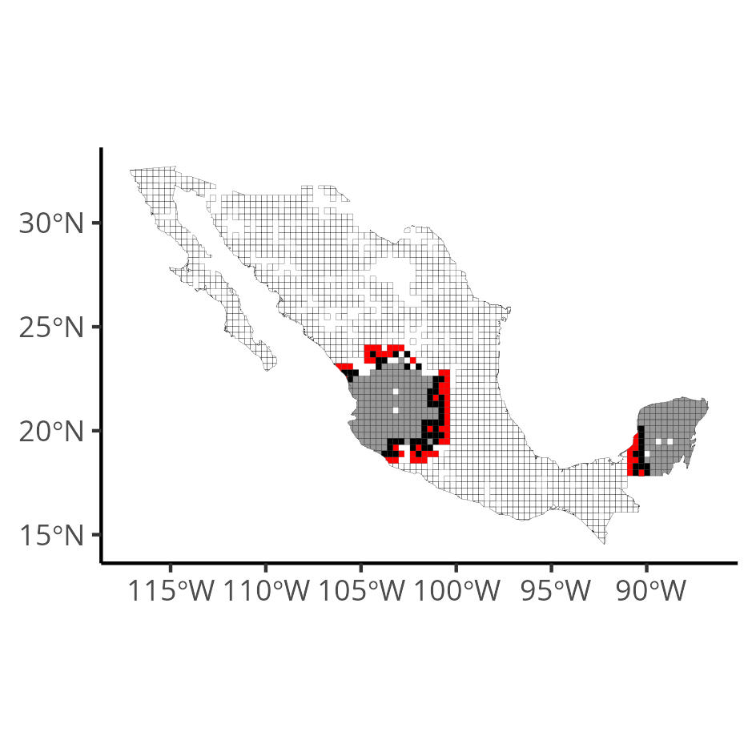
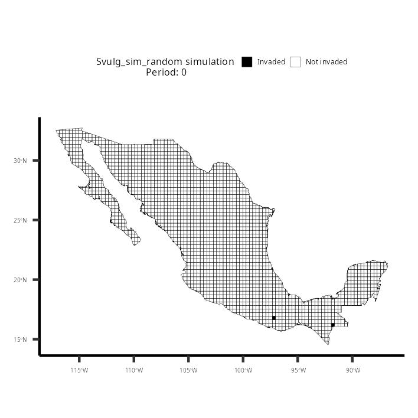
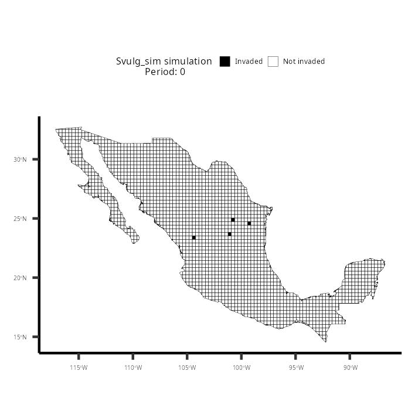

# Invasion process and their simulation

This constitute the supplementary material of _Factors affecting invasion process of a megadiverse country by two exotic bird species_ ([Ceja-Madrigal et al.2023](https://www.sciencedirect.com/science/article/pii/S2213305423000322?dgcid=coauthor#ack0005)). In this document we show how to use the functions `invasion_process` and `sim_spatialinvasion` in a tandem assessment framework, following a single example of their use. In this example we provide data obtained from [GBIF.org](GBIF.org) [(11 April 2022; GBIF Occurrence Download)](https://doi.org/10.15468/dl.8z9dxy) of _Sturnus vulgaris_ in continental Mexico, using a 30x30 km grid across continental Mexico.


## invasion process

The `invasion_process` R function receives and `sf` object of a single multipolygons layer grid. Each grid-cell (polygon) that constitute the grid must contain an attribute/column of an `id` character vector and a `date` of the first recorded invasion. If the polygon is not actively invaded `date` is declared as `NA`. The function calculates the number of neighboring grid-cell actively invaded and the time in months since an adjacent neighbor was invaded. If the focal polygon is not invaded, it provided the interval in months relative to a preferential date, declared in `max_date_ymd`.

Following our example we show a grided layer with each grid-cell identified by `FID` as an `id` and the attribute `frst_nv`, which shows their first record of _Sturnus vulgaris_. If `frst_nv` is `NA`, then it does not have any records of _Sturnus vulgaris_. We also show the layer in Figure 1.
```{r setup, echo=T, message=FALSE, warning=F, }
#load required libraries
library(sf)
library(lubridate)
library(dplyr)
library(ggplot2)

#Load invasion_process from this repository using 'devtools' package
devtools::source_url("https://raw.githubusercontent.com/Rodpach/Invasion_process/master/invasion_process.R")

ES_shapefile = as.list(c("/ES_30x30_mex.shp", "/ES_30x30_mex.shx", "/ES_30x30_mex.dbf", "/ES_30x30_mex.prj"))

#Download layer in temporary directory

lapply(ES_shapefile, function(x){
  download.file(paste("https://github.com/Rodpach/Invasion_process/raw/master", x, sep = ""), destfile = paste(tempdir(), x, sep = ""), quiet = T)
})

#Load shapfiles from temporary directory
Svulg_30x30 = st_read(paste(tempdir(), ES_shapefile[[1]], sep = ""), quiet = T)

Svulg_30x30
```

```{r Fig1, fig.cap= "Figure 1. Continental Mexico grided by 30x30 km3 squares. We show grid-cells as black when records of ES are present and when not we show them as an absence", echo=FALSE, fig.align='center'}
ggplot()+
      geom_sf(data = Svulg_30x30, aes(fill = ifelse(!is.na(frst_nv), "1", NA)), size = 0.05)+
      labs(fill = "Records of ES")+
      scale_fill_manual(values = "black", labels = c("Presence", "Absence"), na.value = "transparent")+
      theme_classic()+
      theme(legend.position = c(.9, .8), legend.key.size = unit(0.15, "cm"), legend.title.align = 0.5,
            legend.title = element_text(size = 15), legend.text = element_text(size = 13),
            text = element_text(size = 10))
```
_Figure 1. Continental Mexico grided by 30x30 km3 squares. We show grid-cells as black when records of ES are present and when not we show them as an absence_
\n
With our obtained layer we are ready to use `invasion_process`. The function delivers the same layer with added values for each individual cells, regarding the interval of time in months since the first invaded neighbor  (`period_months_first_invasion`), the number of `invaded_neighbors` and if it is `invaded` (*1*)  or not (*0*).:
```{r invasion_process, echo=T}
#Assess the invasion process
Svulg_30x30_ip = invasion_process(layer = Svulg_30x30, date_col = "frst_nv", poligon_id_col = "FID", max_date_ymd = "2022-03-01")

Svulg_30x30_ip
```

## sim_spatialinvasion

`sim_spatialinvasion` allows to simulate a spatially explicit permanent spread with a random growth or a fixed growth rate. This function uses a multipolygon grided layer only with an attribute/column specifying the id of each grid-cell or polygon. The purpose of `sim_spatialinvasion` is to contrast an **observed cumulative grid-cell expansion rate** and the **simulated cumulative grid-cell expansion over a period of time**. The simulated expansion can be specified with the number of starting invaded grid-cells, and if the expansion grows randomly `(growth_rate = F)` or at a fixed growth rate (i.e. `(growth_rate = 1.09)` for a growth rate of 9%). To exemplify the use of this function we will continue to use the `Svulg_30x30` grided layer of continental Mexico.

We first obtained the values to calculate the expansion rates.
```{r observed_rate, echo=T, results='hide'}

#Firs we obtain the observe rates.
Svulg_invasion_obsrate = Svulg_30x30[,1:2] # we obtain the FID and first invatio day of each grid-cell
st_geometry(Svulg_invasion_obsrate) = NULL #We remove spatial properties from object to obtain a tibble
Svulg_invasion_obsrate$year = year(Svulg_invasion_obsrate$frst_nv) #we creat a year of first record column
Svulg_invasion_obsrate = filter(Svulg_invasion_obsrate, !is.na(year)) |> #We use count the obtain the new record per year
  count(year) |> mutate(n_cum = cumsum(n))  #We perform a cumulative summary of each new record.
Svulg_invasion_obsrate
```


```{r observed_rate_t, echo=F, warning=FALSE}
knitr::kable(head(Svulg_invasion_obsrate, 10), caption = "Table 1. We show the first five periods of time (years) and their respective number of grid-cells invaded per year (n) and their cumulative count per year (n_cum).")
```

We proceed to load `sim_spatialinvasion`. We first use a blank layer template from invasions and we only keep our layers' **id**, represented by the attribute/column `FID`. We then obtained the period range. To use `sim_spatialinvasion`, in addition to the blank layer, you also need to provide  as a character vector the column name that has the *id* of your polygons and also the name of the simulation as a character vector. The number of grid-cells invaded at the start is specified at `invasion_seed = 2` (for two staring grid-cells). You can also create an animated gif of the simulation by declaring `print_gif = T`. This can only be done if the `magick` package is installed `install.packages("magick")`. This is not crucial and you do not need it to run simulations.
```{r sim_spatialinvasion, include=TRUE, echo=T, results='hide'}
#Loads sim_spatialinvasion function from our our github repository usin 'devtools' package.
devtools::source_url("https://raw.githubusercontent.com/Rodpach/Invasion_process/master/sim_spatialinvasion.R")

Svulg_30x30_sim = Svulg_30x30[, 1] #Remove invasion values to obtain a blank grid layer template.

Svulg_invasion_obsrate_period = range(Svulg_invasion_obsrate$year) #First and last year of records
Svulg_invasion_obsrate_period = Svulg_invasion_obsrate_period[2]-Svulg_invasion_obsrate_period[1] #obtain the period of time

#
# RANDOM EXPANSION
#
Svulg_30x30_simrandom_df_ = sim_spatialinvasion(layer_template = Svulg_30x30_sim, poligon_id_col = "FID", sim_name = "Svulg_sim_random",
                                     invasion_period = Svulg_invasion_obsrate_period, invasion_seed = 2, 
                                     random_growth = T, 
                                     print_gif = F, path_gif = getwd())

#
#FIXED GROWTH RATE, USINg THE COMPOUND RATE FORMULA, USING OBSERVED VALUES.
#


Svulg_30x30_sim_df = sim_spatialinvasion(layer_template = Svulg_30x30_sim, poligon_id_col = "FID", sim_name = "Svulg_sim",
                                     invasion_period = Svulg_invasion_obsrate_period, invasion_seed = 2,
                                     random_growth = F, 
                                     growth_rate = ((444-1) ^ (1 / Svulg_invasion_obsrate_period)), #Fixed growth rate calculated using de compound rate formula and the observed data. 444 is the final number of gridcells.
                                     print_gif = F, path_gif = getwd())
```

We show both, the random and the fixed growth rate:

```{r random, echo=F, warning=FALSE}
knitr::kable(head(Svulg_30x30_simrandom_df_, 10), caption = "Table 2. Data frame of Simulated random expansion values, provided by sim_spatialinvasion.")
```

```{r fixed, echo=F, warning=FALSE}
knitr::kable(head(Svulg_30x30_sim_df, 10), caption = "Table 3. Data frame of Simulated fixed expansion values, provided by sim_spatialinvasion.")
```


```{r Fig2, fig.cap= "Figure 2. Contrast of observed versus simulated cumulatice growth rate of ES.", echo=FALSE, fig.align='center', message=FALSE}
Svulg_invasion_obsrate = left_join(Svulg_invasion_obsrate, data.frame(year = 1953:2021, invasion_period = 1:length(1953:2021)))


ggplot(Svulg_invasion_obsrate)+
  geom_line(aes(invasion_period, n_cum, color = "Observed"))+
  geom_line(data = Svulg_30x30_sim_df, aes(invasion_period, invasion_n2, color = "Simulated: fixed"))+
  geom_line(data = Svulg_30x30_simrandom_df_, aes(invasion_period, invasion_n2, color = "Simulated: random"))+
  scale_color_manual(values = c("red", "gray", "black"))+
  labs(x = "Period", y = "Cumulative Grid-cells")+
  theme_classic()+
  theme(legend.position = c(0.12, .85), legend.title = element_blank())
```

_Figure 2. Contrast of observed versus simulated cumulatice growth rate of ES._

To understand how `sim_spatialinvasion` works, we provide a detail explanation, accompanied by visual explanation in Figure 2. Given that only invaded cells can only expand to non-invaded neighboring grid-cells, in this example we show that only 62 of the total invaded grid-cells (347) are adjacent to non-invaded grid-cells (61). In the case of a random growth, the minimum and the maximum of gri-cells to be invaded in the next step can be any number between 0 and 61. `sim_spatialinvasion` work with the `sample` function to randomize the process in each step. In the case of a fixed growth rato, we consider a **1.09** expansion rate, the gained grid-cells for the next period will be `62*.09 = 5.58`, which we upper round at a 6 new grid-cells. This new invaded grid-cells can only be obtained from the non-invaded adjacent grid-cell pool (61 red grid-cells) but the new invaded grid-cells are chosen randomly with the `sample` function, given the non-invaded adjacent grid-cell pool and the fixed growth rate:
```{r Fig3, echo=FALSE, fig.cap="Figure 3. sim_spatialinvasion functioning. We show Gray and black grid-cells with an active invasion (347 grid-cells), while non-active invasions with with an active invaded neigbor are represented by red grid-cells  (61 grid-cells). The invaded grid-cells adjacent to non-invaded grid-cells are show in black (62 grid-cells)", out.width = '100%', fig.align='center'}

```
_Figure 3. sim_spatialinvasion functioning. We show Gray and black grid-cells with an active invasion (347 grid-cells), while non-active invasions with with an active invaded neigbor are represented by red grid-cells  (61 grid-cells). The invaded grid-cells adjacent to non-invaded grid-cells are show in black (62 grid-cells)", out.width = '100%', fig.align='center_

We show an animated simulation of random and fixed growth.
```{r Fig4, echo=FALSE, fig.cap="Figure 4. Animated simulation of ES, with 2 starting invasion seeds and a random growth, limited to an interval of 68 periods, which is equal to the observed period.", out.width = '100%', fig.align='center'}

```
_Figure 4. Animated simulation of ES, with 4 starting invasion seeds and a fixed growth rate of 1.09, limited by an interval of 68 periods, which is equal to the observed period._

```{r Fig5, echo=FALSE, fig.cap="Figure 5. Animated simulation of ES, with 4 starting invasion seeds and a fixed growth rate of 1.09, limited by an interval of 68 periods, which is equal to the observed period.", out.width = '100%', fig.align='center'}

```
_Figure 5. Animated simulation of ES, with 4 starting invasion seeds and a fixed growth rate of 1.09, limited by an interval of 68 periods, which is equal to the observed period._