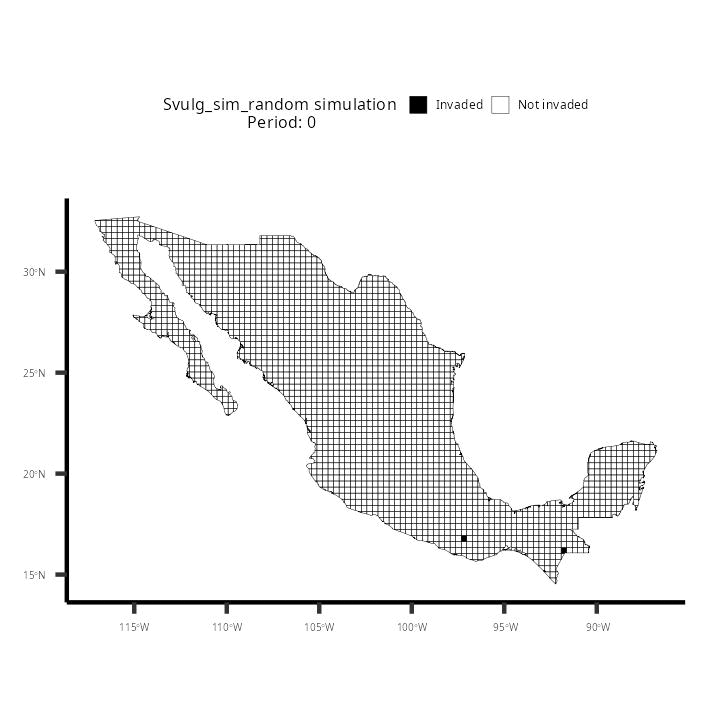
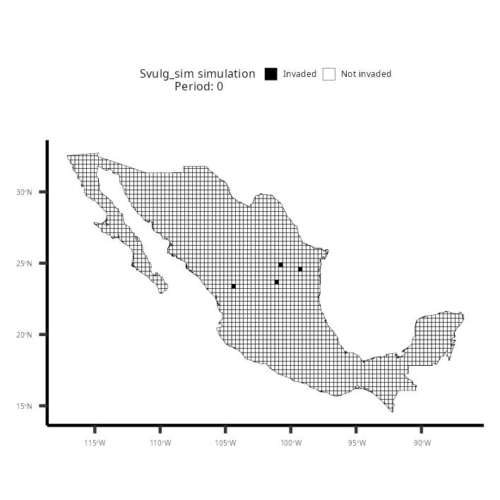

Assessment of invasion processes and their simulations
================
R. Pacheco-Muñoz

# Invasion process and their simulation

This constitute the supplementary material of *FACTORS AFFECTING
INVASION PROCESS OF THE EUROPEAN STARLING (STURNUS VULGARIS) AND THE
EURASIAN COLLARED DOVE (STREPTOPELIADECAOCTO) IN A MEGADIVERSE COUNTRY*
(Ceja-Madrigal et al.XXXX; *in press*). In this document we show how to
use the functions `invasion_process` and `sim_spatialinvasion` in a
tandem assessment framework, following a single example of their use. In
this example we provide data obtained from [GBIF.org](GBIF.org) [(11
April 2022; GBIF Occurrence
Download)](https://doi.org/10.15468/dl.8z9dxy) of *Sturnus vulgaris* in
continental Mexico, using a 30x30 km grid across continental Mexico.

## invasion process

The `invasion_process` R function receives and `sf` object of a single
multipolygons layer grid. Each grid-cell (polygon) that constitute the
grid must contain an attribute/column of an `id` character vector and a
`date` of the first recorded invasion. If the polygon is not actively
invaded `date` is declared as `NA`. The function calculates the number
of neighboring grid-cell actively invaded and the time in months since
an adjacent neighbor was invaded. If the focal polygon is not invaded,
it provided the interval in months relative to a preferential date,
declared in `max_date_ymd`.

Following our example we show a grided layer with each grid-cell
identified by `FID` as an `id` and the attribute `frst_nv`, which shows
their first record of *Sturnus vulgaris*. If `frst_nv` is `NA`, then it
does not have any records of *Sturnus vulgaris*. We also show the layer
in Figure 1.

``` r
#load required libraries
library(sf)
library(lubridate)
library(dplyr)
library(ggplot2)

#Load invasion_process from this repository using 'devtools' package
devtools::source_url("https://raw.githubusercontent.com/Rodpach/Invasion_process/master/invasion_process.R")

ES_shapefile = as.list(c("/ES_30x30_mex.shp", "/ES_30x30_mex.shx", "/ES_30x30_mex.dbf", "/ES_30x30_mex.prj"))

#Download layer in temporary directory

lapply(ES_shapefile, function(x){
  download.file(paste("https://github.com/Rodpach/Invasion_process/raw/master", x, sep = ""), destfile = paste(tempdir(), x, sep = ""), quiet = T)
})
```

    ## [[1]]
    ## [1] 0
    ## 
    ## [[2]]
    ## [1] 0
    ## 
    ## [[3]]
    ## [1] 0
    ## 
    ## [[4]]
    ## [1] 0

``` r
#Load shapfiles from temporary directory
Svulg_30x30 = st_read(paste(tempdir(), ES_shapefile[[1]], sep = ""), quiet = T)

Svulg_30x30
```

    ## Simple feature collection with 2184 features and 2 fields
    ## Geometry type: MULTIPOLYGON
    ## Dimension:     XY
    ## Bounding box:  xmin: -117.1264 ymin: 14.53401 xmax: -86.74038 ymax: 32.71877
    ## Geodetic CRS:  WGS 84
    ## First 10 features:
    ##    FID frst_nv                       geometry
    ## 1    0    <NA> MULTIPOLYGON (((-92.52642 1...
    ## 2    1    <NA> MULTIPOLYGON (((-92.22642 1...
    ## 3    2    <NA> MULTIPOLYGON (((-92.18282 1...
    ## 4    3    <NA> MULTIPOLYGON (((-92.82642 1...
    ## 5    4    <NA> MULTIPOLYGON (((-92.54392 1...
    ## 6    5    <NA> MULTIPOLYGON (((-92.52642 1...
    ## 7    6    <NA> MULTIPOLYGON (((-92.10998 1...
    ## 8    7    <NA> MULTIPOLYGON (((-93.12642 1...
    ## 9    8    <NA> MULTIPOLYGON (((-92.83495 1...
    ## 10   9    <NA> MULTIPOLYGON (((-92.82642 1...


*Figure 1. Continental Mexico grided by 30x30 km3 squares. We show
grid-cells as black when records of ES are present and when not we show
them as an absence* With our obtained layer we are ready to use
`invasion_process`. The function delivers the same layer with added
values for each individual cells, regarding the interval of time in
months since the first invaded neighbor
(`period_months_first_invasion`), the number of `invaded_neighbors` and
if it is `invaded` (*1*) or not (*0*).:

``` r
#Assess the invasion process
Svulg_30x30_ip = invasion_process(layer = Svulg_30x30, date_col = "frst_nv", poligon_id_col = "FID", max_date_ymd = "2022-03-01")

Svulg_30x30_ip
```

    ## Simple feature collection with 2184 features and 5 fields
    ## Geometry type: MULTIPOLYGON
    ## Dimension:     XY
    ## Bounding box:  xmin: -117.1264 ymin: 14.53401 xmax: -86.74038 ymax: 32.71877
    ## Geodetic CRS:  WGS 84
    ## First 10 features:
    ##    FID frst_nv period_months_first_invasion invaded_neighbors invaded
    ## 1    0    <NA>                            0                 0       0
    ## 2    1    <NA>                            0                 0       0
    ## 3    2    <NA>                            0                 0       0
    ## 4    3    <NA>                            0                 0       0
    ## 5    4    <NA>                            0                 0       0
    ## 6    5    <NA>                            0                 0       0
    ## 7    6    <NA>                            0                 0       0
    ## 8    7    <NA>                            0                 0       0
    ## 9    8    <NA>                            0                 0       0
    ## 10   9    <NA>                            0                 0       0
    ##                          geometry
    ## 1  MULTIPOLYGON (((-92.52642 1...
    ## 2  MULTIPOLYGON (((-92.22642 1...
    ## 3  MULTIPOLYGON (((-92.18282 1...
    ## 4  MULTIPOLYGON (((-92.82642 1...
    ## 5  MULTIPOLYGON (((-92.54392 1...
    ## 6  MULTIPOLYGON (((-92.52642 1...
    ## 7  MULTIPOLYGON (((-92.10998 1...
    ## 8  MULTIPOLYGON (((-93.12642 1...
    ## 9  MULTIPOLYGON (((-92.83495 1...
    ## 10 MULTIPOLYGON (((-92.82642 1...

## sim_spatialinvasion

`sim_spatialinvasion` allows to simulate a spatially explicit permanent
spread with a random growth or a fixed growth rate. This function uses a
multipolygon grided layer only with an attribute/column specifying the
id of each grid-cell or polygon. The purpose of `sim_spatialinvasion` is
to contrast an **observed cumulative grid-cell expansion rate** and the
**simulated cumulative grid-cell expansion over a period of time**. The
simulated expansion can be specified with the number of starting invaded
grid-cells, and if the expansion grows randomly `(growth_rate = F)` or
at a fixed growth rate (i.e. `(growth_rate = 1.09)` for a growth rate of
9%). To exemplify the use of this function we will continue to use the
`Svulg_30x30` grided layer of continental Mexico.

We first obtained the values to calculate the expansion rates.

``` r
#Firs we obtain the observe rates.
Svulg_invasion_obsrate = Svulg_30x30[,1:2] # we obtain the FID and first invatio day of each grid-cell
st_geometry(Svulg_invasion_obsrate) = NULL #We remove spatial properties from object to obtain a tibble
Svulg_invasion_obsrate$year = year(Svulg_invasion_obsrate$frst_nv) #we creat a year of first record column
Svulg_invasion_obsrate = filter(Svulg_invasion_obsrate, !is.na(year)) |> #We use count the obtain the new record per year
  count(year) |> mutate(n_cum = cumsum(n))  #We perform a cumulative summary of each new record.
Svulg_invasion_obsrate
```

| year |   n | n_cum |
|-----:|----:|------:|
| 1953 |   1 |     1 |
| 1957 |   3 |     4 |
| 1962 |   2 |     6 |
| 1968 |   1 |     7 |
| 1970 |   1 |     8 |
| 1973 |   3 |    11 |
| 1975 |   1 |    12 |
| 1976 |   2 |    14 |
| 1977 |   1 |    15 |
| 1978 |   1 |    16 |

Table 1. We show the first five periods of time (years) and their
respective number of grid-cells invaded per year (n) and their
cumulative count per year (n_cum).

We proceed to load `sim_spatialinvasion`. We first use a blank layer
template from invasions and we only keep our layers’ **id**, represented
by the attribute/column `FID`. We then obtained the period range. To use
`sim_spatialinvasion`, in addition to the blank layer, you also need to
provide as a character vector the column name that has the *id* of your
polygons and also the name of the simulation as a character vector. The
number of grid-cells invaded at the start is specified at
`invasion_seed = 2` (for two staring grid-cells). You can also create an
animated gif of the simulation by declaring `print_gif = T`. This can
only be done if the `magick` package is installed
`install.packages("magick")`. This is not crucial and you do not need it
to run simulations.

``` r
#Loads sim_spatialinvasion function from our our github repository usin 'devtools' package.
devtools::source_url("https://raw.githubusercontent.com/Rodpach/Invasion_process/master/sim_spatialinvasion.R")
```

    ## ℹ SHA-1 hash of file is "830ecd3eee6ae2d5f423bedb85314410c53663c9"

``` r
Svulg_30x30_sim = Svulg_30x30[, 1] #Remove invasion values to obtain a blank grid layer template.

Svulg_invasion_obsrate_period = range(Svulg_invasion_obsrate$year) #First and last year of records
Svulg_invasion_obsrate_period = Svulg_invasion_obsrate_period[2]-Svulg_invasion_obsrate_period[1] #obtain the period of time

#
# RANDOM EXPANSION
#
Svulg_30x30_simrandom_df_ = sim_spatialinvasion(layer_template = Svulg_30x30_sim, poligon_id_col = "FID", sim_name = "Svulg_sim_random",
                                     invasion_period = Svulg_invasion_obsrate_period, invasion_seed = 2, 
                                     random_growth = T, 
                                     print_gif = F, path_gif = getwd())

#
#FIXED GROWTH RATE, USINg THE COMPOUND RATE FORMULA, USING OBSERVED VALUES.
#


Svulg_30x30_sim_df = sim_spatialinvasion(layer_template = Svulg_30x30_sim, poligon_id_col = "FID", sim_name = "Svulg_sim",
                                     invasion_period = Svulg_invasion_obsrate_period, invasion_seed = 2,
                                     random_growth = F, 
                                     growth_rate = ((444-1) ^ (1 / Svulg_invasion_obsrate_period)), #Fixed growth rate calculated using de compound rate formula and the observed data. 444 is the final number of gridcells.
                                     print_gif = F, path_gif = getwd())
```

We show both, the random and the fixed growth rate:

| invasion_period | invasion_n | invasors | available | invasion_gain | invasion_n2 | sim_name         | seed_n |
|----------------:|-----------:|---------:|----------:|--------------:|------------:|:-----------------|-------:|
|               0 |          2 |        0 |        NA |             0 |           0 | Svulg_sim_random |      2 |
|               1 |          2 |        2 |        16 |             0 |           2 | Svulg_sim_random |      2 |
|               2 |          2 |        2 |        16 |             7 |           9 | Svulg_sim_random |      2 |
|               3 |          9 |        9 |        30 |            21 |          30 | Svulg_sim_random |      2 |
|               4 |         30 |       27 |        42 |            36 |          66 | Svulg_sim_random |      2 |
|               5 |         66 |       47 |        55 |            33 |          99 | Svulg_sim_random |      2 |
|               6 |         99 |       60 |        72 |            27 |         126 | Svulg_sim_random |      2 |
|               7 |        126 |       83 |        94 |            67 |         193 | Svulg_sim_random |      2 |
|               8 |        193 |      108 |       102 |            90 |         283 | Svulg_sim_random |      2 |
|               9 |        283 |       97 |        98 |            61 |         344 | Svulg_sim_random |      2 |

Table 2. Data frame of Simulated random expansion values, provided by
sim_spatialinvasion.

| invasion_period | invasion_n | invasors | available | invasion_gain | invasion_n2 | sim_name  | seed_n |
|----------------:|-----------:|---------:|----------:|--------------:|------------:|:----------|-------:|
|               0 |          2 |        0 |        NA |             0 |           0 | Svulg_sim |      2 |
|               1 |          2 |        2 |        15 |             1 |           3 | Svulg_sim |      2 |
|               2 |          3 |        3 |        18 |             1 |           4 | Svulg_sim |      2 |
|               3 |          4 |        4 |        20 |             1 |           5 | Svulg_sim |      2 |
|               4 |          5 |        5 |        24 |             1 |           6 | Svulg_sim |      2 |
|               5 |          6 |        6 |        27 |             1 |           7 | Svulg_sim |      2 |
|               6 |          7 |        7 |        26 |             1 |           8 | Svulg_sim |      2 |
|               7 |          8 |        8 |        29 |             1 |           9 | Svulg_sim |      2 |
|               8 |          9 |        9 |        28 |             1 |          10 | Svulg_sim |      2 |
|               9 |         10 |       10 |        27 |             1 |          11 | Svulg_sim |      2 |

Table 3. Data frame of Simulated fixed expansion values, provided by
sim_spatialinvasion.


*Figure 2. Contrast of observed versus simulated cumulatice growth rate
of ES.*

To understand how `sim_spatialinvasion` works, we provide a detail
explanation, accompanied by visual explanation in Figure 2. Given that
only invaded cells can only expand to non-invaded neighboring
grid-cells, in this example we show that only 62 of the total invaded
grid-cells (347) are adjacent to non-invaded grid-cells (61). In the
case of a random growth, the minimum and the maximum of gri-cells to be
invaded in the next step can be any number between 0 and 61.
`sim_spatialinvasion` work with the `sample` function to randomize the
process in each step. In the case of a fixed growth rato, we consider a
**1.09** expansion rate, the gained grid-cells for the next period will
be `62*.09 = 5.58`, which we upper round at a 6 new grid-cells. This new
invaded grid-cells can only be obtained from the non-invaded adjacent
grid-cell pool (61 red grid-cells) but the new invaded grid-cells are
chosen randomly with the `sample` function, given the non-invaded
adjacent grid-cell pool and the fixed growth rate:

*Figure 3. sim_spatialinvasion functioning. We show Gray and black
grid-cells with an active invasion (347 grid-cells), while non-active
invasions with with an active invaded neigbor are represented by red
grid-cells (61 grid-cells). The invaded grid-cells adjacent to
non-invaded grid-cells are show in black (62 grid-cells)“, out.width =
‘100%’, fig.align=’center*

We show an animated simulation of random and fixed growth.

*Figure 4. Animated simulation of ES, with 4 starting invasion seeds and
a fixed growth rate of 1.09, limited by an interval of 68 periods, which
is equal to the observed period.*


*Figure 5. Animated simulation of ES, with 4 starting invasion seeds and
a fixed growth rate of 1.09, limited by an interval of 68 periods, which
is equal to the observed period.*
